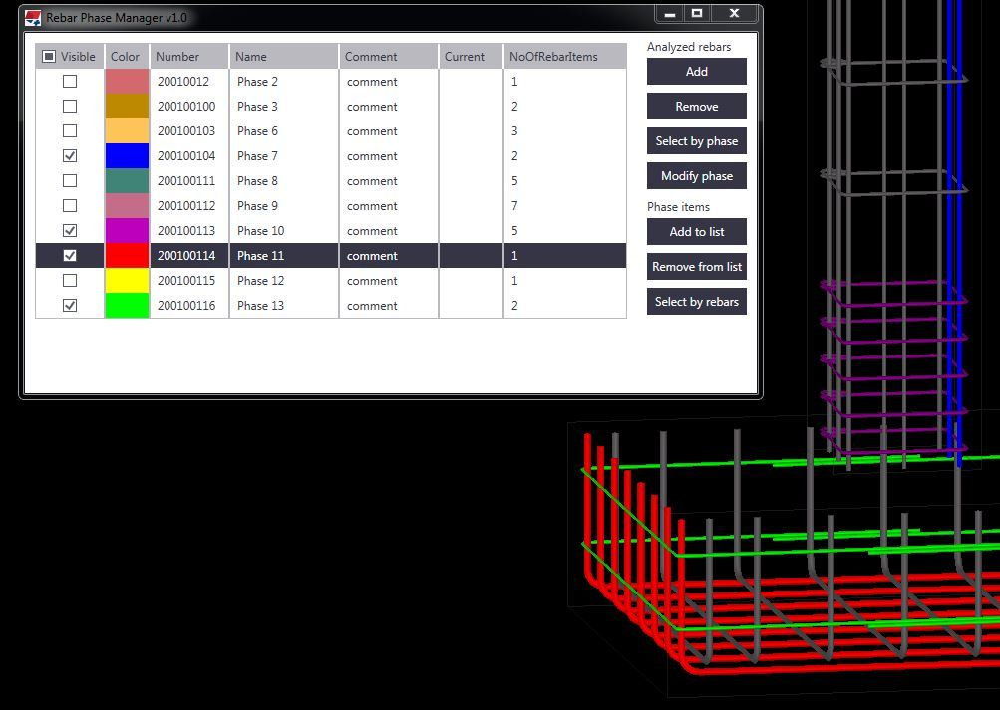

# RebarPhasesManager
Tekla Structures Application, that allows the user to visualize and manage rebar phases.

## Table of contents
* [General info](#general-info)
* [Technologies](#technologies)
* [Screenshots](#screenshots)
* [Features](#features)
* [Status](#status)
* [Contact](#contact)

## General info
The aim of this app is to group rebars (previously added to the application) by phases and set a distinct color for each of them. Application window contains a list of phases with a color legend. It allows the user to manage phases of rebars and visualize them in Tekla to easy analyze correctness of data.

## Technologies
* C#
* WPF
* .NET Framework - version 4.5
* TeklaOpenAPI - version 2017.1.10074

## Screenshot

## Features
* Add and remove rebars to application
* Change visibility of analyzed phases in Tekla
* Select rebars in Tekla for phases selected in the application
* Modify phase for selected rebars
* Add and remove phases from Tekla to application
* Select phase in app window for rebars selected in Tekla

## Status
Project is finished.

## Contact
Created by [mkrzeminski90@gmail.com] - fell free to contact me
